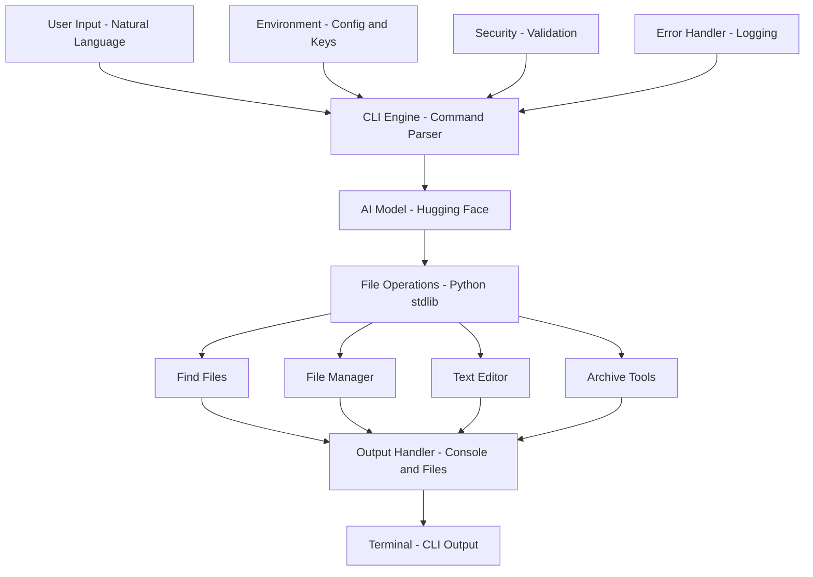

# 🤖🗂️ Tiny-Agents – The Conversational File & Document AI Engine


**Automate your desktop with natural language. Summarize, organize, and command your files—just by talking!**


## 🚀 Executive Synopsis

Welcome to **Tiny-Agents**: your all-in-one, natural language-powered desktop automation assistant! Effortlessly manage files, organize folders, and generate rich document summaries—just by talking to your computer. Powered by Hugging Face LLMs and robust Python automation, Tiny-Agents brings the future of productivity to your terminal.

---


## 🎯 Core Competencies & Capabilities

- 🔍 **Find Anything** – Instantly locate files by name, extension, or keyword
- 📂 **Smart File & Folder Operations** – Move, copy, create, delete, and zip with natural language
- 📝 **Edit with Ease** – Append or replace text in any file, all from the CLI
- 🧠 **AI-Powered Summaries** – Get multi-paragraph, topic-complete document summaries (Hugging Face LLM)
- 💬 **Conversational Interface** – If you can say it, Tiny-Agents can probably do it!

---


## 🏗️ System Architecture & Design

Tiny-Agents is built with a layered, modular architecture for clarity, reliability, and future scalability. See the system design below:



```mermaid
flowchart TD
    %% User Interface
    USER[User Input - Natural Language]
    TERMINAL[Terminal - CLI Output]
    %% Core Processing
    CLI[CLI Engine - Command Parser]
    LLM[AI Model - Hugging Face]
    FILES[File Operations - Python stdlib]
    %% Support Systems
    ENV[Environment - Config and Keys]
    OUTPUT[Output Handler - Console and Files]
    SECURITY[Security - Validation]
    LOGGER[Error Handler - Logging]
    %% File Tools
    FIND[Find Files]
    MANAGE[File Manager]
    TEXT[Text Editor]
    ARCHIVE[Archive Tools]
    %% Main Flow
    USER --> CLI
    CLI --> LLM
    LLM --> FILES
    FILES --> FIND
    FILES --> MANAGE
    FILES --> TEXT
    FILES --> ARCHIVE
    %% Return Path
    FIND --> OUTPUT
    MANAGE --> OUTPUT
    TEXT --> OUTPUT
    ARCHIVE --> OUTPUT
    OUTPUT --> TERMINAL
    %% Support Connections
    ENV --> CLI
    SECURITY --> CLI
    LOGGER --> CLI
```

### 🗂️ Component Matrix

| 🧩 Component                | ⚙️ Technology         | 🎯 Functional Purpose                                 |
|----------------------------|----------------------|------------------------------------------------------|
| 🤖 CLI Command Engine       | Python               | Natural language command parsing & execution         |
| 🧠 Summarization LLM        | Hugging Face API     | High-fidelity, multi-paragraph document summarization|
| 📂 File/Folder Operations   | Python stdlib        | Robust file, folder, and zip management              |
| 🔐 Env Management           | python-dotenv        | Secure API key & model configuration                 |
| 📤 Output Orchestration     | Console, Files       | Save, print, or archive results                      |
| 🛡️ Error Handling & Logging | Python logging       | Robust error capture, user feedback, and traceability|
| 🔒 Security & Validation    | Python, stdlib       | Input validation, safe file operations, .env secrets |

---

---


## 🔄 How the AI Agent Workflow Operates

> **From your words to real results – see how Tiny-Agents brings your requests to life!**

1. 👤 **User** types a request in the terminal, like:
   > “Create a file named note.txt with the text ‘Hello’.”
2. 🤖 **Tiny-Agent** sends your message to the LLM (Hugging Face).
3. 🧠 **LLM** reads your request and decides:
   > “To do this, I need to use the file creation tool.”
4. 🛠️ **LLM** tells the agent:
   > “Please call this tool with these inputs.”
5. 📂 **Tiny-Agent** uses MCP (Model Context Protocol) to call the correct tool (like createFile from the file system server).
6. 📝 **The tool runs** (actually creates the file) and returns a result like:
   > “✅ File created successfully.”
7. 🧠 **LLM** sees the tool result and writes a final reply like:
   > “Done! The file note.txt was created.”
8. 💬 **Tiny-Agent** shows the final answer to the user in the terminal.
9. 🔁 **In short:**
   User → LLM → decides tool → MCP tool runs → result → LLM → reply → User

> **Note:**
> The LLM doesn’t run the tool itself — it just tells the agent which tool to use and what inputs to give. The AI Agent does the actual tool call using MCP, waits for the result, and then the LLM gives you the final response.


## �️ Project Structure

```text
Tiny-Agents/
├── agent.py         # Main CLI agent
├── requirements.txt # Python dependencies
├── README.md        # This file
└── .env             # Your API keys and model config (not included by default)
```

---


## � Example Commands

Try these natural language commands:

- `find pdf`
- `move file1.txt to archive.txt`
- `copy notes.txt to backup.txt`
- `append "hello world" to notes.txt`
- `replace "foo" with "bar" in notes.txt`
- `create folder myfolder`
- `create file newfile.txt`
- `zip file1.txt, file2.txt as archive.zip`
- `delete file old.txt`
- `delete folder myfolder`
- `summarize notes.txt and save to summary.txt`
- `summarize doc.txt from archive.zip and save to summary.txt`
- `summarize of notes.txt`

---


## 🤗 Hugging Face LLM Installation & Configuration

### Prerequisites
- Python 3.8+
- Hugging Face account & API token

### 🚦 Quickstart
```bash
# 1. Clone the repository
git clone https://github.com/yourusername/Tiny-Agents.git
cd Tiny-Agents

# 2. Create a virtual environment (recommended)
python -m venv venv
# venv\Scripts\activate   # On Windows
source venv/bin/activate  # On Linux/macOS

# 3. Install dependencies
pip install -r requirements.txt

# 4. Configure your Hugging Face API token and model in .env
echo HF_TOKEN=your_huggingface_token_here > .env
echo MODEL_ID=facebook/bart-large-cnn >> .env

# 5. Run the agent
python agent.py
```

### 🚀 Recommended Summarization Models
- `facebook/bart-large-cnn` (default)
- `google/pegasus-xsum`

---


## 🧠 Operational Command Matrix

| 🛠️ Operation                | 💬 Example Command                                      |
|----------------------------|--------------------------------------------------------|
| Find files                 | `find pdf`                                             |
| Move file                  | `move file1.txt to file2.txt`                          |
| Copy file                  | `copy file1.txt to file2.txt`                          |
| Append text                | `append "hello" to notes.txt`                          |
| Replace text               | `replace "foo" with "bar" in notes.txt`                |
| Create folder              | `create folder myfolder`                               |
| Create file                | `create file newfile.txt`                              |
| Zip files                  | `zip file1.txt, file2.txt as archive.zip`              |
| Delete file                | `delete file old.txt`                                  |
| Delete folder              | `delete folder myfolder`                               |
| Summarize file             | `summarize notes.txt and save to summary.txt`          |
| Summarize from archive     | `summarize doc.txt from archive.zip and save to summary.txt` |
| Summarize and print        | `summarize of notes.txt`                               |

---


## 🙏 Acknowledgments

- 🤗 [Hugging Face](https://huggingface.co/) – LLMs & API
- 🐍 Python – The language of automation
- 💡 Open-source community & AI agent pioneers

---


## 💬 Get Creative!

Unleash the power of natural language to automate your desktop. If you can say it, Tiny-Agents can probably do it! 🚀


🎉 Thank you for exploring Tiny-Agents! Enjoy automating your world, one command at a time. Happy hacking! 😃🤖✨
