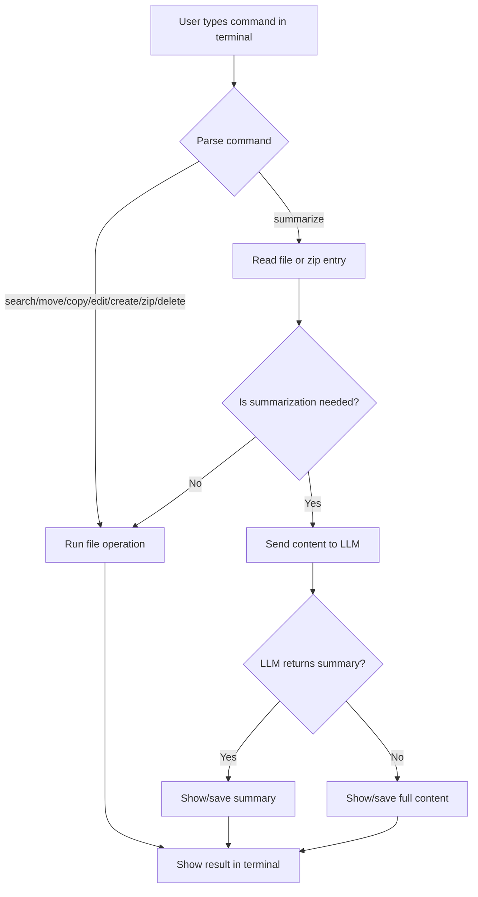

# 🤖 Tiny Agents Client

A lightweight, natural-language command-line assistant for managing files and folders on your Desktop using Model Context Protocol (MCP) and AI.

---


## 📦 Dependencies

Before running the project, you must install the following npm packages:

```
npm install adm-zip @huggingface/mcp-client dotenv
```

These are required for:
- `adm-zip`: Compressing files into zip archives and reading files inside zips (summarization and compression features)
- `@huggingface/mcp-client`: Connecting to the LLM and MCP Filesystem Server (all agent/LLM/MCP features)
- `dotenv`: Loading environment variables from your `.env` file

---

## 🚀 Getting Started

1. **Open a terminal** in the `tiny-agents-client` folder.
2. **Install dependencies:**
   ```
   npm install adm-zip @huggingface/mcp-client dotenv
   ```
3. **Get a Hugging Face API token:**
   - Sign up or log in at [https://huggingface.co/](https://huggingface.co/)
   - Go to your account settings and create an access token.
4. **Create a `.env` file** in the project folder and add your Hugging Face API key:
   ```
   HF_TOKEN=your_huggingface_api_key
   ```
5. **Start the agent:**
   ```
   node index.js
   ```
6. **Type your natural language commands** in the terminal (see examples below).

---

## ✨ Features
- **Search files** by name or type
- **Move/Copy files**
- **Edit files** (append or replace text)
- **Create folders**
- **Compress files** into .zip archives
- **Summarize files** (including files inside .zip) using AI
- **Delete files**
- **All actions via natural language commands**

---

## 🏗️ Architecture Overview

```
+-------------------+         +-------------------+         +-------------------+
|  User (Terminal)  | <-----> | Tiny Agents Client| <-----> |   MCP Server      |
+-------------------+         +-------------------+         +-------------------+
         |                            |                              |
         | 1. User types command      |                              |
         +--------------------------->|                              |
         |                            |                              |
         | 2. Command parsed &        |                              |
         |    matched to tool         |                              |
         +--------------------------->|                              |
         |                            |                              |
         | 3. File operation or       |                              |
         |    LLM request             |                              |
         +--------------------------->|                              |
         |                            | 4. If file access needed     |
         |                            +----------------------------->|
         |                            |                              |
         |                            | 5. File data returned        |
         |                            |<-----------------------------+
         |                            |                              |
         | 6. If summarization,       |                              |
         |    send to LLM             |                              |
         |                            |                              |
         | 7. LLM returns summary     |                              |
         |                            |                              |
         | 8. Output shown or saved   |                              |
         +<--------------------------+                               |
```

---

## 🔄 Flow Chart



---

## 🧠 How It Works
1. **User types a natural language command** (e.g., "summarize the contents of gdp.txt from archive.zip and save to summary.txt").
2. **The agent parses the command** and matches it to a tool (search, move, summarize, etc.).
3. **If file access is needed**, the agent uses the MCP Filesystem Server to read/write files on your Desktop.
4. **If summarization is requested**, the agent sends the file content to an AI model (LLM) for summarization.
5. **If the LLM returns nothing**, the agent falls back to showing the full file content.
6. **The result is shown in the terminal and/or saved to a file** (like summary.txt).

---

## 💬 Example Commands
- `find all pdf files on my desktop`
- `move report.txt to archive/report.txt`
- `append 'hello' to notes.txt`
- `replace 'foo' with 'bar' in data.txt`
- `create folder named projects`
- `zip notes.txt, data.txt into backup.zip`
- `summarize the contents of gdp.txt from archive.zip and save to summary.txt`
- `delete the file old.txt from my desktop`

---

## 🛠️ Requirements
- Node.js
- MCP Filesystem Server (runs automatically via npx)
- HuggingFace API key (for LLM summarization)

---

## 📁 Project Structure
- `index.js` — Main agent logic and command parsing
- `package.json` — Project dependencies
- `.env` — API keys and config

---

## 📝 Notes
- All file operations are performed on your Desktop (`C:/Users/<username>/Desktop`).
- Summarization uses an LLM; if the model returns nothing, the full file content is shown instead.
- All commands are plain English—no need to remember syntax or file paths.

---

## 🙏 Acknowledgments

- Hugging Face for the MCP client and LLM API
- Model Context Protocol (MCP) for the filesystem server
- Inspiration from Hugging Face's Tiny Agents blog
- Node.js and the open-source community

---

## 📜 License
MIT

---

🎉 Thank you for using Tiny Agents! Enjoy managing your files with natural language. If you like this project, give it a ⭐️ and have fun! 😃🚀
